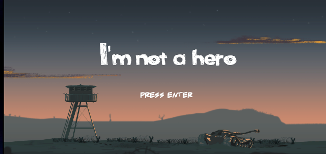
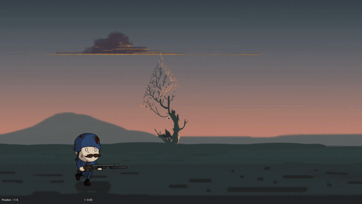

This game is combining classic Run and Gun gameplay with a Racing Game, the goal is not to get the higher score
but to get to the finish line before your opponents !

[play it online](https://guillaume-gomez.github.io/LD41/build/)

# Game Detail

The game is an horizontal scroller.
You start with 5 other "allies" that will run against you to get to the end of the level first.
There are also enemies shooting at you to try to prevent you to get to the end of the level.

All shootings will not kill you but slow you down. 
There are also some obstacles along the road like crates or barbed wire that you will have to deal with.

 
# Dev Details

First time working together with this team, first time using unity. What a bumpy road it was :smile:
We ended up a bit overwhelmed by all the features we wanted to cram into the game: NPC running the race, 
shooting, and mostly character animation (some sweet fuel for future nightmare).
The experience was tense and fun at the same time and we leveled up for the next Ludum Dare

Sending Love to all LD participant :heart:

# Controls

Move     ->     w/a/s/d

Jump     ->     Space

Shoot    ->     Left Click or Ctrl

# Team
- Leo Delisle : Graphics
- Eloi Calleja: Graphics
- Corentin Bescond: Graphics
- Matthieu Realini : Sound design / FX / Game Design
- Florian Coulouma: Narration
- Maxime Lambert: Concept / Game Design
- Guillaume Gomez: Programming

## Link to LDjam page

[ludum dare page](https://ldjam.com/events/ludum-dare/41/im-not-a-hero)
